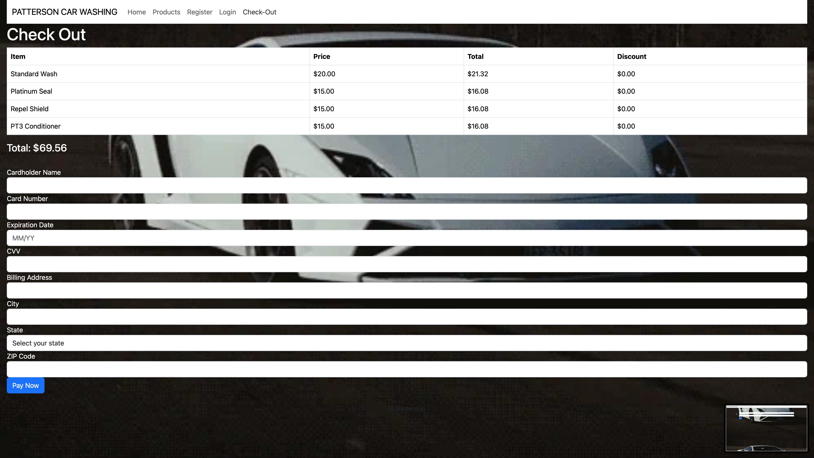

Hey this is my first official attempt at truly front end coding! And through my efforts I have come to this point, The idea of my website is Patterson Car Washing, a family orientated car washing company with many benefits and a large margin of customizable services. 
.Home Page

.Products

.Registration

.Login

Checkout

